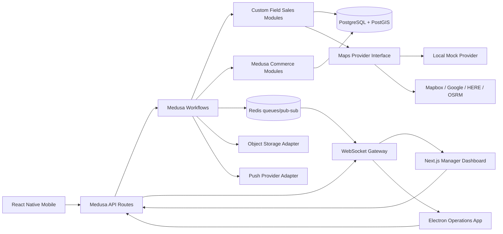

# High-Level Architecture

The backend owns tenant-aware business workflows. Client applications do not embed routing, permission, tenant or order business rules. They call typed API contracts and subscribe to authorised event streams.

PostgreSQL/PostGIS is the source of truth. Redis accelerates queue processing and fan-out but is never the only durable record. External maps, object storage and push notification providers are behind interfaces so local development and tests use deterministic mock providers.
